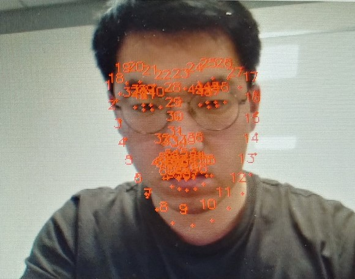
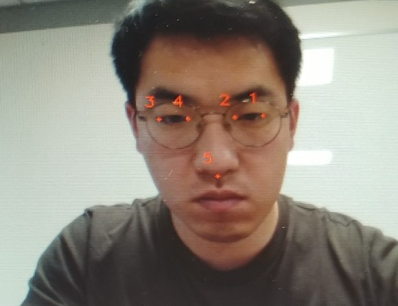

+ Test Environment
 - Raspberrypi 3B, 4B (Jessie+) or Ubuntu
 - python 3.3+ / dlib 19.6+ / opencv 3.3+ (I think the slightly lower version will not matter.)
 - ageitgey/face_recognition and pyimagesearch.com (Reference)

+ File list
 - python3 dbtest.py --record [Trained File]
  + Check Pretrained File
 - python3 train.py --image [Image_File] --name [Face Name] --record [Trained File] --mode [init/add]
  + init > Trained File rewrite
  + add > Append to Trained File
 - python3 landmark.py # Demo face landmark detection
 - python3 demo.py --record [Trained File] # Demo face recognition

+ Requirements (22.10.25)
 - dlib==19.24.0
 - numpy==1.23.4
 - opencv-python==4.6.0.66

